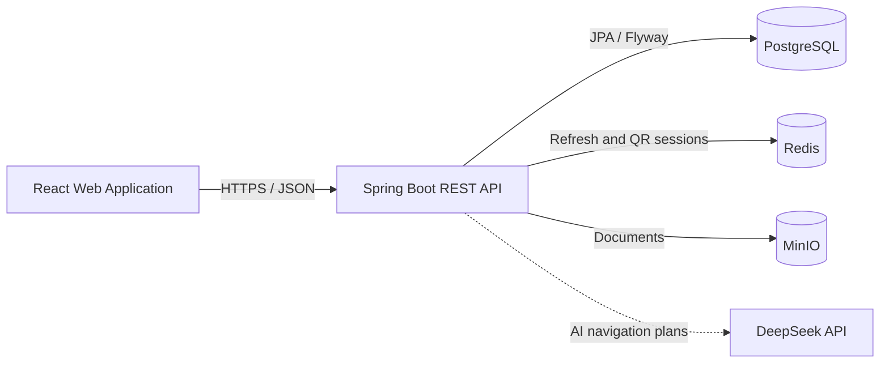

# University Management Platform

An end-to-end university operations platform covering the complete academic lifecycle: institutional structure, enrollment, teaching allocation, scheduling, attendance, assessment, progression, and graduation.

The platform connects these operations through one consistent academic model. Programs and yearly curricula flow into student registrations, teaching requirements, Professor assignments, timetables, examinations, grade decisions, progression, and graduation while preserving historical academic context.

## Live Demo

Explore the read-only deployment at **[ysnunvdemo.yassinechouikh.com](https://ysnunvdemo.yassinechouikh.com/)**.

The deployed API can be explored through **[Swagger UI](https://ysnunvdemo.yassinechouikh.com/swagger-ui/index.html)**.

The application serves three workspaces from one React frontend:

- **Management** for root administrators, establishment super administrators, and delegated administrators.
- **Professor** for teaching assignments, schedules, attendance, examinations, and grades.
- **Student** for academic context, schedules, results, attendance, and progression.

Authorization remains enforced by the Spring Boot API. The frontend adapts navigation and available actions to the authenticated role and permissions.

## Core Capabilities

- University and establishment governance
- Role-based account and delegated permission management
- Academic structure and curriculum configuration
- Student registration, semester registration, and second inscriptions
- Class, TD, and TP group generation and assignment
- Professor expertise, teaching requirements, and teaching assignments
- Weekly and examination scheduling with room allocation
- Examination candidate lists and grade workflows
- Configurable validation, compensation, and progression rules
- Semester results, progression decisions, and graduation decisions
- Professor-managed attendance with QR-assisted check-in
- Absence justification documents and review
- Read-only AI navigation assistant for management users

## Architecture

The repository is a modular monolith with independently packaged business areas inside one Spring Boot application and one React application.



PostgreSQL is the system of record. Redis stores short-lived refresh-token and attendance QR sessions. MinIO stores uploaded document content while PostgreSQL stores its metadata. The AI assistant is read-only and executes only authenticated GET requests already exposed by the application.

## Technology

| Area | Technology |
|---|---|
| Backend | Java 17, Spring Boot 4, Spring MVC, Spring Security, Spring Data JPA |
| Database | PostgreSQL 16, Flyway, pgvector for AI knowledge retrieval |
| Session data | Redis 7 |
| Object storage | MinIO |
| Frontend | React 19, TypeScript, Vite, React Router, TanStack Query |
| API contract | OpenAPI, Springdoc, generated TypeScript client types |
| Testing | JUnit, Spring Security Test, Vitest, Testing Library, Playwright |
| Delivery | Docker, Docker Compose, GitHub Actions |

## Repository Structure

```text
backend/                 Spring Boot API and Flyway migrations
frontend/                React application and generated API client
infra/compose/           Local container environment
.github/workflows/       Continuous integration
docs/                    Architecture and domain documentation
```

Backend packages are organized by business module. Each substantial module separates domain, application, infrastructure, and presentation concerns. Frontend code is grouped by feature and by the management, professor, and student workspaces.

## Local Environment

### Prerequisites

- Docker with Docker Compose
- Java 17
- Node.js 22 and npm 10+

### Configuration

Create local environment files from the provided templates:

```bash
cp .env.example .env
cp backend/.env.example backend/.env
cp frontend/.env.example frontend/.env
```

Docker Compose reads the root `.env` file, and Vite reads `frontend/.env`. When running Spring Boot directly, export the backend variables in the shell or rely on the local defaults. Replace all example secrets before using a shared or deployed environment. The optional AI assistant also requires `DEEPSEEK_API_KEY` in the backend process environment.

### Start Infrastructure

```bash
docker compose -f infra/compose/docker-compose.yml up -d postgres redis minio
```

### Start the Backend

```bash
cd backend
set -a; source .env; set +a
./mvnw spring-boot:run
```

The API runs on `http://localhost:8080` by default.

### Start the Frontend

```bash
cd frontend
npm ci
npm run dev
```

The development frontend runs on `http://localhost:5173` by default.

The complete container stack can instead be started with:

```bash
docker compose -f infra/compose/docker-compose.yml up --build
```

## Verification

```bash
cd backend && ./mvnw test
cd frontend && npm run typecheck && npm test && npm run build
```

GitHub Actions runs the backend test suite and the frontend typecheck, tests, and production build for pull requests and pushes to `main` or `develop`.

## API Documentation

With the backend running:

- Swagger UI: `http://localhost:8080/swagger-ui.html`
- OpenAPI document: `http://localhost:8080/v3/api-docs`
- Health endpoint: `http://localhost:8080/actuator/health`

## Documentation

- [System architecture](docs/system-architecture.md)
- [Domain model](docs/domain-model.md)
- [Focused domain diagrams](docs/focused-domain-diagrams.md)
- [Database design](docs/database-design.md)
- [AI navigation architecture](docs/ai-navigation-architecture.md)

The OpenAPI document is the authoritative HTTP contract. The documents above explain the architecture, domain boundaries, relationships, and persistence model.

## AI Navigation Beta

The Super Admin and Admin workspaces include a grounded, read-only assistant for finding records, answering operational questions, and opening the relevant management context. It combines hybrid retrieval, DeepSeek planning, deterministic API execution, and route validation while preserving the caller's existing authorization boundaries.

See [AI navigation architecture](docs/ai-navigation-architecture.md) for the retrieval pipeline, planning flow, security controls, and current beta scope.
