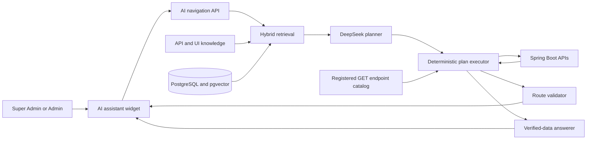
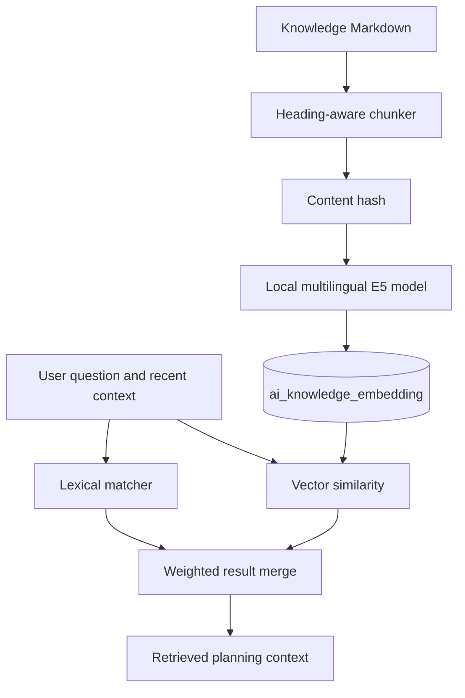
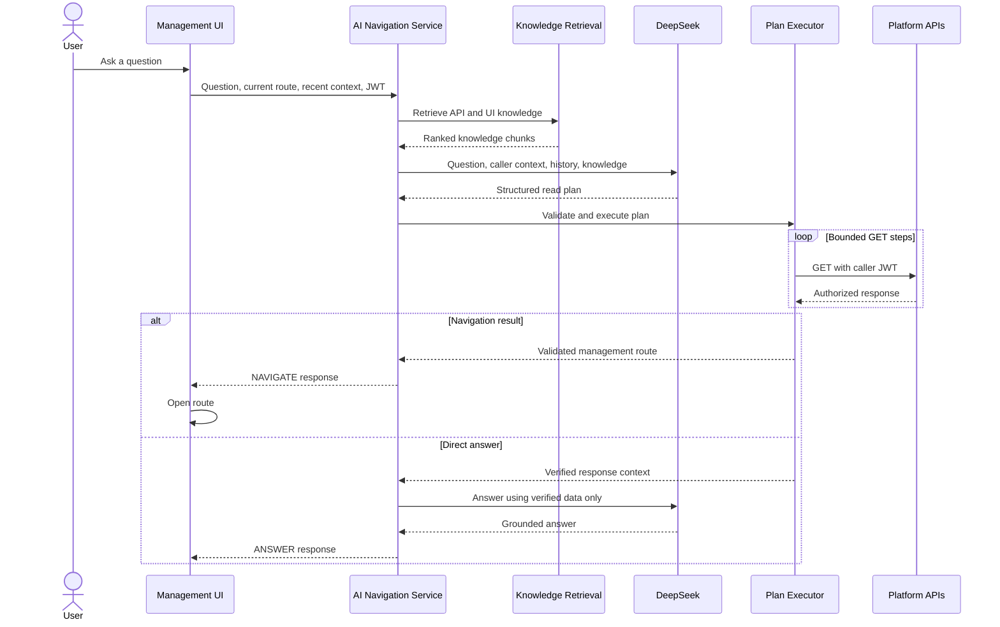

# AI Navigation Architecture

The AI navigation assistant is a read-only interface for finding university records, answering operational questions, and opening the relevant management page. It is available to Super Admins and Admins as a beta feature.

The assistant does not query the database directly and does not replace the platform's authorization model. It converts a question into a bounded plan of existing API reads, executes those reads with the caller's access token, and either returns an answer grounded in the responses or opens a validated frontend route.

## Architecture Overview

The architecture separates probabilistic model work from deterministic application work. DeepSeek proposes a structured plan, but Spring Boot decides whether each endpoint, request, result match, and route is valid.

## Knowledge Base

The retrieval corpus contains two complementary sources:

- **API knowledge** describes implemented read-only endpoints, parameters, response identifiers, matching rules, and multi-request lookup workflows.
- **UI navigation knowledge** maps management pages to frontend routes and documents the identifiers and query parameters required to open each context.

The generated OpenAPI contract remains the authoritative HTTP schema. The curated knowledge documents add the business meaning and navigation relationships that cannot be inferred reliably from endpoint signatures alone.

At startup, Markdown documents are loaded from the application classpath and split into bounded chunks by heading. Each chunk records its source, title, content, and stable identifier.

## Hybrid Retrieval

Retrieval combines lexical and semantic matching:

1. Lexical matching prioritizes exact endpoint names, identifiers, academic terms, and close spelling variants.
2. A local multilingual E5 ONNX model embeds the question and knowledge chunks.
3. PostgreSQL with `pgvector` performs cosine-similarity search over stored embeddings.
4. Lexical and semantic scores are normalized, weighted, merged, and ranked.
5. The highest-ranked API and UI chunks are supplied to the planner.

Knowledge chunks are hashed. Embeddings are generated only for new or changed chunks and are reused from PostgreSQL on later starts. If semantic indexing is unavailable, retrieval falls back to lexical matching instead of disabling the assistant.

## Request Flow

The frontend sends the question, current route, and up to five recent in-memory messages to `POST /api/v1/ai/navigation`. Conversation history is used only to resolve follow-up references and is cleared when the page reloads; it is not persisted as chat data.

## Planning and Execution

The planner chooses one of two modes:

- `NAVIGATE` resolves the required records and produces a frontend destination.
- `ANSWER` resolves the required data and produces a direct answer in the assistant.

A plan contains ordered GET steps, query parameters, field matches, optional bounded fan-out, and references to values returned by earlier steps. This supports requests that require a chain such as resolving a student, locating the relevant academic registration, and then reading semester results.

The model does not execute its own plan. The deterministic executor:

- validates the plan structure and unique step identifiers;
- resolves variables only from caller context or completed API responses;
- limits total API calls and collection fan-out;
- rejects missing or ambiguous record matches;
- bounds API response and answer-context sizes;
- records completed reads for optional diagnostics.

If an execution fails because the model used an incorrect endpoint, query, response field, dependency, or route, the service permits one repair plan using the failure and completed response previews. If the original retrieval lacks required documentation, it permits one additional retrieval and planning attempt. Both fallbacks are bounded.

## Security Boundaries

The assistant operates within the same security boundary as the user:

- The AI endpoint is restricted to `SUPER_ADMIN` and `ADMIN` roles.
- Only registered Spring MVC `GET` endpoints under `/api/v1/` are eligible.
- Authentication and AI endpoints are excluded from internal execution.
- Every internal request forwards the caller's existing bearer token.
- Spring Security, method authorization, establishment scope, and permission checks still apply normally.
- Generated paths cannot contain external hosts, fragments, traversal segments, encoded path manipulation, or unregistered endpoints.
- Generated routes must stay inside the management workspace allowed for the caller's role.
- Mutation endpoints are absent from the corpus and cannot be executed by the gateway.

The language model therefore proposes reads but never receives authority to bypass the application.

## Frontend Behavior

The management widget supports short, in-memory conversations. It includes the current browser route so relative questions can use the page context. A successful navigation result opens the resolved route automatically, while a direct-answer result remains in the conversation.

Diagnostics are disabled by default. When enabled for development, the response can expose retrieval matches, model-call timing, generated plans, validated API reads, response previews, and execution failures. They should remain disabled in normal deployments.

## Configuration

The feature is configured through backend environment variables:

| Variable | Purpose |
| --- | --- |
| `DEEPSEEK_API_KEY` | Authenticates requests to the planning provider |
| `DEEPSEEK_BASE_URL` | Overrides the DeepSeek-compatible API endpoint |
| `DEEPSEEK_MODEL` | Selects the planning model |
| `AI_EMBEDDING_MODEL_URI` | Location of the local ONNX embedding model |
| `AI_EMBEDDING_TOKENIZER_URI` | Location of the embedding tokenizer |
| `AI_SEMANTIC_RETRIEVAL_ENABLED` | Enables or disables pgvector retrieval |
| `AI_RETRIEVAL_LIMIT` | Limits retrieved chunks per knowledge source |
| `AI_MAXIMUM_API_CALLS` | Bounds reads in one generated plan |
| `AI_MAXIMUM_FAN_OUT` | Bounds collection expansion during a plan |
| `AI_NAVIGATION_DIAGNOSTICS_ENABLED` | Includes execution diagnostics when enabled |

The model API key must be provided through the backend process environment and must never be committed to the repository or exposed to the frontend.

## Current Scope

The assistant is intentionally marked beta. Its accuracy depends on the completeness of the API and UI knowledge corpus and on the model producing a valid structured plan. It currently covers read-only management questions and navigation for Super Admins and Admins. It does not perform administrative mutations, persist conversations, or operate in the Root Super Admin, Professor, or Student workspaces.
