# Domain Model

This document defines the conceptual domain model of the university management platform. It covers the entities, business meaning, relationships, constraints, and conceptual diagrams used by the implemented system.

Course, TD, and TP delivery is configured per yearly Subject/Module occurrence. Concrete teaching requirements, Professor assignments, rooms, and timetable entries are generated and reviewed within a semester context.

## 1. Complete Class Diagram

```mermaid
classDiagram
class University {
  +name
}

class Establishment {
  +name
  +status
}

class UserAccount {
  +universityEmail
  +role
  +accountStatus
}

class UserProfile {
  +firstName
  +lastName
  +birthDate
  +placeOfBirth
  +nationality
  +cin
  +sex
  +phoneNumber
  +profilePicture
}

class RootSuperAdmin
class SuperAdmin
class Admin
class Professor {
  +employeeNumber
  +hireDate
  +maximumWeeklyTeachingMinutes
}
class AcademicRank {
  +code
  +name
  +seniorityOrder
  +canHoldModuleResponsibility
  +status
}
class TeachingAssignmentRankPreference {
  +componentType
  +priority
  +status
}
class Student {
  +apogeeCode
  +nationalStudentCode
  +initialEnrollmentDate
}

class Permission {
  +code
  +name
}

class AdminPermissionGrant {
  +grantedAt
}

class Department {
  +name
}

class DegreeCycle {
  +name
}

class ProgramPath {
  +name
}

class ProgramFiliere {
  +name
  +code
}

class AcademicLevel {
  +name
  +order
  +terminalLevel
}

class AcademicYear {
  +label
  +startYear
  +endYear
  +status
}

class Semester {
  +name
  +order
  +termType
  +startDate
  +endDate
  +lifecycleStatus
}

class SubjectModule {
  +code
  +title
}

class AcademicDomain {
  +code
  +name
}

class ProfessorExpertise

class ModuleTeachingComponent {
  +componentType
  +sessionsPerWeek
  +sessionDurationMinutes
  +audienceMode
  +requiredRoomType
}

class TeachingGroupPolicy {
  +groupType
  +minimumGroupSize
  +maximumGroupSize
}

class SubjectModuleDomain

class ClassGroup {
  +name
}

class TeachingGroup {
  +name
  +audienceType
  +groupType
  +sourceClassGroup
}

class TeachingGroupMembership

class TeachingRequirement {
  +status
}

class Block {
  +code
  +name
  +status
}

class Room {
  +code
  +name
  +roomType
  +capacity
  +status
}

class AcademicRegistration {
  +status
}

class SemesterRegistration

class StudentClassAssignment

class ModuleRegistration {
  +inscriptionNumber
  +status
}

class TeachingAssignment {
  +status
  +assignmentSource
}

class ModuleClassResponsibility {
  +status
}

class SemesterSchedule {
  +publicationStatus
  +publishedAt
}

class ScheduleEntry {
  +dayOfWeek
  +startTime
  +endTime
}

class ExamSchedule {
  +publicationStatus
  +sessionType
  +startDate
  +endDate
}

class ModuleExam {
  +examDate
  +startTime
  +endTime
  +candidateListGeneratedAt
}

class ExamGroup {
  +label
  +groupOrder
}

class ExamGroupMembership

class ExamRoomAllocation

class GradeRecord {
  +gradeValue
  +zeroGradeReason
  +workflowStatus
}

class ModuleResult {
  +finalGradeValue
  +resultStatus
  +originalFinalGradeValue
  +originalResultStatus
  +calculatedAt
}

class SemesterResult {
  +semesterAverage
  +resultStatus
  +originalSemesterAverage
  +originalResultStatus
  +evaluatedAt
}

class ProgressionDecision {
  +decisionStatus
  +annualAverage
  +outstandingModuleCount
  +decidedAt
}

class GraduationDecision {
  +decisionStatus
  +graduationAverage
  +decidedAt
}

class AcademicRuleProfile {
  +name
  +version
  +ruleDefinition
  +status
}

class AcademicRuleSet {
  +moduleRules
  +semesterRules
  +academicLevelRules
  +progressionRules
  +useSharedSemesterRules
  +autumnSemesterRules
  +springSemesterRules
}

class AcademicLevelRuleAssignment {
  +status
}

class AbsenceRecord {
  +absenceDate
  +justified
}

class AttendanceQrSession {
  +attendanceDate
  +token
  +tokenExpiresAt
  +closesAt
}

class AbsenceJustification {
  +reason
  +status
  +submittedAt
  +reviewedAt
}

class UploadedDocument {
  +originalFilename
  +contentType
  +sizeBytes
  +purpose
  +status
}

class ExamCandidate

UserAccount --> UserProfile : personal_profile
UserAccount --> RootSuperAdmin : profile
UserAccount --> SuperAdmin : profile
UserAccount --> Admin : profile
UserAccount --> Professor : profile
UserAccount --> Student : profile

University --> Establishment : contains
RootSuperAdmin --> University : governs

Establishment --> SuperAdmin : has
Establishment --> Admin : has
Establishment --> Professor : has
Establishment --> Student : has
Establishment --> Department : contains
Establishment --> DegreeCycle : defines
Establishment --> ProgramPath : defines
Establishment --> AcademicYear : manages
Establishment --> AcademicRuleProfile : defines
AcademicRuleProfile --> AcademicRuleSet : rule_definition

Admin --> AdminPermissionGrant : has_grant
AdminPermissionGrant --> Permission : references

Department --> ProgramFiliere : offers
DegreeCycle --> ProgramFiliere : frames
ProgramPath --> ProgramFiliere : classifies
ProgramFiliere --> AcademicLevel : contains
AcademicLevel --> Semester : contains
AcademicYear --> Semester : scopes
Semester --> SubjectModule : contains
AcademicLevel --> ClassGroup : has_groups
AcademicYear --> ClassGroup : scoped_by
AcademicLevel --> AcademicLevelRuleAssignment : governed_by
AcademicYear --> AcademicLevelRuleAssignment : effective_for
AcademicRuleProfile --> AcademicLevelRuleAssignment : assigned_through

Student --> AcademicRegistration : registers_in
ProgramFiliere --> AcademicRegistration : target
AcademicYear --> AcademicRegistration : scoped_by
AcademicLevel --> AcademicRegistration : registered_level

AcademicRegistration --> SemesterRegistration : contains
Semester --> SemesterRegistration : semester
SemesterRegistration --> StudentClassAssignment : has_class_assignment
StudentClassAssignment --> ClassGroup : assigned_to

SemesterRegistration --> ModuleRegistration : includes
SubjectModule --> ModuleRegistration : module
AcademicLevel --> ModuleRegistration : origin_for_carried_module

Professor --> TeachingAssignment : teaches
Professor --> ModuleClassResponsibility : responsible_for
Professor --> ProfessorExpertise : has_expertise
Establishment --> AcademicRank : defines
AcademicRank --> Professor : classifies
Establishment --> TeachingAssignmentRankPreference : configures
TeachingAssignmentRankPreference --> AcademicRank : prefers
ProfessorExpertise --> AcademicDomain : domain
SubjectModule --> ModuleTeachingComponent : delivery_components
AcademicLevel --> TeachingGroupPolicy : grouping_policy
AcademicYear --> TeachingGroupPolicy : effective_for
SubjectModule --> SubjectModuleDomain : classified_by
SubjectModuleDomain --> AcademicDomain : domain
Semester --> TeachingGroup : teaching_audiences
ClassGroup --> TeachingGroup : source_class
TeachingGroup --> TeachingGroupMembership : contains
TeachingGroupMembership --> SemesterRegistration : member
ModuleTeachingComponent --> TeachingRequirement : generates
TeachingGroup --> TeachingRequirement : target_audience
TeachingRequirement --> TeachingAssignment : assigned_through
SubjectModule --> ModuleClassResponsibility : responsibility_for
ClassGroup --> ModuleClassResponsibility : scoped_to
AcademicYear --> ModuleClassResponsibility : effective_for
Semester --> ModuleClassResponsibility : effective_for

Establishment --> SemesterSchedule : owns
Establishment --> AcademicDomain : defines
Establishment --> Block : owns
Establishment --> Room : owns
Block --> Room : optionally_groups
AcademicYear --> SemesterSchedule : scoped_by
Semester --> SemesterSchedule : scoped_by
SemesterSchedule --> ScheduleEntry : contains
TeachingAssignment --> ScheduleEntry : schedules
Room --> ScheduleEntry : hosts

Establishment --> ExamSchedule : owns
AcademicYear --> ExamSchedule : scoped_by
Semester --> ExamSchedule : scoped_by
ExamSchedule --> ModuleExam : contains
ModuleExam --> SubjectModule : for_module
ModuleExam --> ClassGroup : for_group
ExamSchedule --> ExamGroup : defines_exam_groups
ClassGroup --> ExamGroup : split_from
ExamGroup --> ExamGroupMembership : contains
ExamGroupMembership --> SemesterRegistration : member
ModuleExam --> ExamRoomAllocation : room_allocations
ExamGroup --> ExamRoomAllocation : allocated_group
Room --> ExamRoomAllocation : hosts
ModuleExam --> ExamCandidate : has_candidates
ModuleRegistration --> ExamCandidate : invited_for

ModuleExam --> GradeRecord : produces
GradeRecord --> ModuleRegistration : result_for
ModuleRegistration --> ModuleResult : resolves_to
GradeRecord --> ModuleResult : contributes_to
AcademicRuleProfile --> ModuleResult : calculates_under

SemesterRegistration --> SemesterResult : results_in
ModuleResult --> SemesterResult : evaluated_by
AcademicRuleProfile --> SemesterResult : calculates_under

AcademicRegistration --> ProgressionDecision : results_in
AcademicRuleProfile --> ProgressionDecision : policy_for
AcademicRegistration --> GraduationDecision : terminal_completion

ModuleRegistration --> AbsenceRecord : has_absence
TeachingAssignment --> AbsenceRecord : records
TeachingAssignment --> AttendanceQrSession : opens_for
Professor --> AttendanceQrSession : controls
AbsenceRecord --> AbsenceJustification : has_submissions
Student --> AbsenceJustification : submits
Professor --> AbsenceJustification : reviews
AbsenceJustification "1" --> "1" UploadedDocument : supports_with
UserAccount --> UploadedDocument : owns

```

## 2. Conceptual ERD

```mermaid
erDiagram
    UNIVERSITY ||--o{ ESTABLISHMENT : contains

    USER_ACCOUNT ||--|| USER_PROFILE : personal_profile
    USER_ACCOUNT ||--o| ROOT_SUPER_ADMIN : profile
    USER_ACCOUNT ||--o| SUPER_ADMIN : profile
    USER_ACCOUNT ||--o| ADMIN : profile
    USER_ACCOUNT ||--o| PROFESSOR : profile
    USER_ACCOUNT ||--o| STUDENT : profile

    ESTABLISHMENT ||--o{ SUPER_ADMIN : has
    ESTABLISHMENT ||--o{ ADMIN : has
    ESTABLISHMENT ||--o{ PROFESSOR : has
    ESTABLISHMENT ||--o{ STUDENT : has
    ESTABLISHMENT ||--o{ DEPARTMENT : contains
    ESTABLISHMENT ||--o{ DEGREE_CYCLE : defines
    ESTABLISHMENT ||--o{ PROGRAM_PATH : defines
    ESTABLISHMENT ||--o{ ACADEMIC_YEAR : manages
    ESTABLISHMENT ||--o{ ACADEMIC_RULE_PROFILE : defines
    ESTABLISHMENT ||--o{ ACADEMIC_DOMAIN : defines
    ESTABLISHMENT ||--o{ ACADEMIC_RANK : defines
    ESTABLISHMENT ||--o{ TEACHING_ASSIGNMENT_RANK_PREFERENCE : configures
    ESTABLISHMENT ||--o{ BLOCK : owns
    ESTABLISHMENT ||--o{ ROOM : owns
    ESTABLISHMENT ||--o{ SEMESTER_SCHEDULE : owns
    ESTABLISHMENT ||--o{ EXAM_SCHEDULE : owns
    ADMIN ||--o{ ADMIN_PERMISSION_GRANT : has_grant
    PERMISSION ||--o{ ADMIN_PERMISSION_GRANT : referenced_by

    DEPARTMENT ||--o{ PROGRAM_FILIERE : offers
    DEGREE_CYCLE ||--o{ PROGRAM_FILIERE : frames
    PROGRAM_PATH ||--o{ PROGRAM_FILIERE : classifies
    ACADEMIC_LEVEL ||--o{ ACADEMIC_LEVEL_RULE_ASSIGNMENT : governed_by
    ACADEMIC_YEAR ||--o{ ACADEMIC_LEVEL_RULE_ASSIGNMENT : effective_for
    ACADEMIC_RULE_PROFILE ||--o{ ACADEMIC_LEVEL_RULE_ASSIGNMENT : assigned_through
    PROGRAM_FILIERE ||--o{ ACADEMIC_LEVEL : contains
    ACADEMIC_LEVEL ||--o{ SEMESTER : contains
    ACADEMIC_YEAR ||--o{ SEMESTER : scopes
    SEMESTER ||--o{ SUBJECT_MODULE : contains
    SUBJECT_MODULE ||--o{ MODULE_TEACHING_COMPONENT : delivery_components
    SUBJECT_MODULE ||--o{ SUBJECT_MODULE_DOMAIN : classified_by
    ACADEMIC_DOMAIN ||--o{ SUBJECT_MODULE_DOMAIN : domain
    PROFESSOR ||--o{ PROFESSOR_EXPERTISE : has_expertise
    ACADEMIC_RANK ||--o{ PROFESSOR : classifies
    ACADEMIC_RANK ||--o{ TEACHING_ASSIGNMENT_RANK_PREFERENCE : preferred_by
    ACADEMIC_DOMAIN ||--o{ PROFESSOR_EXPERTISE : expertise_domain
    ACADEMIC_LEVEL ||--o{ CLASS_GROUP : has_groups
    ACADEMIC_YEAR ||--o{ CLASS_GROUP : scoped_by
    ACADEMIC_LEVEL ||--o{ TEACHING_GROUP_POLICY : grouping_policy
    ACADEMIC_YEAR ||--o{ TEACHING_GROUP_POLICY : effective_for
    PROGRAM_FILIERE ||--o| ACADEMIC_RULE_PROFILE : uses

    STUDENT ||--o{ ACADEMIC_REGISTRATION : registers_in
    PROGRAM_FILIERE ||--o{ ACADEMIC_REGISTRATION : target
    ACADEMIC_LEVEL ||--o{ ACADEMIC_REGISTRATION : registered_level
    ACADEMIC_YEAR ||--o{ ACADEMIC_REGISTRATION : scopes

    ACADEMIC_REGISTRATION ||--o{ SEMESTER_REGISTRATION : contains
    SEMESTER ||--o{ SEMESTER_REGISTRATION : semester
    SEMESTER_REGISTRATION ||--o| STUDENT_CLASS_ASSIGNMENT : has_class_assignment
    CLASS_GROUP ||--o{ STUDENT_CLASS_ASSIGNMENT : assigned_group

    SEMESTER_REGISTRATION ||--o{ MODULE_REGISTRATION : includes
    SUBJECT_MODULE ||--o{ MODULE_REGISTRATION : module
    ACADEMIC_LEVEL ||--o{ MODULE_REGISTRATION : origin_for_carried_module

    SEMESTER ||--o{ TEACHING_GROUP : teaching_audiences
    CLASS_GROUP ||--o{ TEACHING_GROUP : source_class
    TEACHING_GROUP ||--o{ TEACHING_GROUP_MEMBERSHIP : contains
    SEMESTER_REGISTRATION ||--o{ TEACHING_GROUP_MEMBERSHIP : member
    MODULE_TEACHING_COMPONENT ||--o{ TEACHING_REQUIREMENT : generates
    TEACHING_GROUP ||--o{ TEACHING_REQUIREMENT : target_audience
    TEACHING_REQUIREMENT ||--o| TEACHING_ASSIGNMENT : assigned_through
    PROFESSOR ||--o{ TEACHING_ASSIGNMENT : teaches
    PROFESSOR ||--o{ MODULE_CLASS_RESPONSIBILITY : responsible_for
    SUBJECT_MODULE ||--o{ MODULE_CLASS_RESPONSIBILITY : responsibility_for
    CLASS_GROUP ||--o{ MODULE_CLASS_RESPONSIBILITY : scoped_to
    ACADEMIC_YEAR ||--o{ MODULE_CLASS_RESPONSIBILITY : effective_for
    SEMESTER ||--o{ MODULE_CLASS_RESPONSIBILITY : effective_for

    SEMESTER_SCHEDULE ||--o{ SCHEDULE_ENTRY : contains
    TEACHING_ASSIGNMENT ||--o{ SCHEDULE_ENTRY : schedules
    BLOCK o|--o{ ROOM : optionally_groups
    ROOM ||--o{ SCHEDULE_ENTRY : hosts
    ACADEMIC_YEAR ||--o{ SEMESTER_SCHEDULE : scopes
    SEMESTER ||--o{ SEMESTER_SCHEDULE : scopes

    EXAM_SCHEDULE ||--o{ MODULE_EXAM : contains
    MODULE_EXAM }o--|| SUBJECT_MODULE : for_module
    MODULE_EXAM }o--|| CLASS_GROUP : for_group
    EXAM_SCHEDULE ||--o{ EXAM_GROUP : defines_exam_groups
    CLASS_GROUP ||--o{ EXAM_GROUP : split_from
    EXAM_GROUP ||--o{ EXAM_GROUP_MEMBERSHIP : contains
    SEMESTER_REGISTRATION ||--o{ EXAM_GROUP_MEMBERSHIP : member
    MODULE_EXAM ||--o{ EXAM_ROOM_ALLOCATION : room_allocations
    EXAM_GROUP ||--o{ EXAM_ROOM_ALLOCATION : allocated_group
    ROOM ||--o{ EXAM_ROOM_ALLOCATION : hosts
    MODULE_EXAM ||--o{ EXAM_CANDIDATE : has_candidates
    MODULE_REGISTRATION ||--o{ EXAM_CANDIDATE : invited_for
    ACADEMIC_YEAR ||--o{ EXAM_SCHEDULE : scopes
    SEMESTER ||--o{ EXAM_SCHEDULE : scopes

    MODULE_REGISTRATION ||--o{ GRADE_RECORD : has_results
    MODULE_EXAM ||--o{ GRADE_RECORD : produces
    MODULE_REGISTRATION ||--o| MODULE_RESULT : resolves_to
    ACADEMIC_RULE_PROFILE ||--o{ MODULE_RESULT : calculates_under

    SEMESTER_REGISTRATION ||--o| SEMESTER_RESULT : results_in
    ACADEMIC_RULE_PROFILE ||--o{ SEMESTER_RESULT : calculates_under

    ACADEMIC_REGISTRATION ||--o| PROGRESSION_DECISION : results_in
    ACADEMIC_RULE_PROFILE ||--o{ PROGRESSION_DECISION : policy_for
    ACADEMIC_REGISTRATION ||--o| GRADUATION_DECISION : terminal_completion

    MODULE_REGISTRATION ||--o{ ABSENCE_RECORD : has_absence
    TEACHING_ASSIGNMENT ||--o{ ABSENCE_RECORD : records
    ABSENCE_RECORD ||--o{ ABSENCE_JUSTIFICATION : has_submissions
    STUDENT ||--o{ ABSENCE_JUSTIFICATION : submits
    PROFESSOR ||--o{ ABSENCE_JUSTIFICATION : reviews
    ABSENCE_JUSTIFICATION ||--|| UPLOADED_DOCUMENT : supports_with
    USER_ACCOUNT ||--o{ UPLOADED_DOCUMENT : owns

    UNIVERSITY {
        string name
    }

    ESTABLISHMENT {
        string name
        string type
        string status
    }

    USER_ACCOUNT {
        string university_email
        string role_type
        string account_status
    }

    USER_PROFILE {
        string first_name
        string last_name
        date birth_date
        string place_of_birth
        string nationality
        string cin
        string sex
        string phone_number
        string profile_picture
    }

    ROOT_SUPER_ADMIN {
    }

    SUPER_ADMIN {
    }

    ADMIN {
    }

    PROFESSOR {
        string employee_number
        uuid academic_rank_id
        date hire_date
        int maximum_weekly_teaching_minutes
    }

    ACADEMIC_RANK {
        string code
        string name
        int seniority_order
        boolean can_hold_module_responsibility
        string status
    }

    TEACHING_ASSIGNMENT_RANK_PREFERENCE {
        string component_type
        int priority
        string status
    }

    STUDENT {
        string apogee_code
        string national_student_code
        date initial_enrollment_date
    }

    PERMISSION {
        string code
        string name
    }

    ADMIN_PERMISSION_GRANT {
        date granted_at
    }

    DEPARTMENT {
        string name
    }

    DEGREE_CYCLE {
        string name
    }

    PROGRAM_PATH {
        string name
    }

    PROGRAM_FILIERE {
        string code
        string name
    }

    ACADEMIC_LEVEL {
        string name
        int level_order
    }

    ACADEMIC_YEAR {
        string label
        int start_year
        int end_year
        string status
    }

    SEMESTER {
        string name
        int semester_order
        string term_type
        date start_date
        date end_date
    }

    SUBJECT_MODULE {
        string code
        string title
    }

    ACADEMIC_DOMAIN {
        string code
        string name
    }

    PROFESSOR_EXPERTISE {
    }

    MODULE_TEACHING_COMPONENT {
        string component_type
        int sessions_per_week
        int session_duration_minutes
        string audience_mode
        string required_room_type
    }

    TEACHING_GROUP_POLICY {
        string group_type
        int minimum_group_size
        int maximum_group_size
    }

    SUBJECT_MODULE_DOMAIN {
    }

    CLASS_GROUP {
        string name
        string status
    }

    TEACHING_GROUP {
        uuid source_class_group_id
        string name
        string audience_type
        string group_type
    }

    TEACHING_GROUP_MEMBERSHIP {
    }

    TEACHING_REQUIREMENT {
        string status
    }

    BLOCK {
        string code
        string name
        string status
    }

    ROOM {
        string code
        string name
        string room_type
        int capacity
        string status
    }

    ACADEMIC_REGISTRATION {
        string status
    }

    MODULE_REGISTRATION {
        int inscription_number
        string status
    }

    TEACHING_ASSIGNMENT {
        string status
    }

    MODULE_CLASS_RESPONSIBILITY {
        string status
    }

    SEMESTER_SCHEDULE {
        string publication_status
    }

    SCHEDULE_ENTRY {
        string day_of_week
        string start_time
        string end_time
    }

    EXAM_SCHEDULE {
        string publication_status
        string session_type
        date start_date
        date end_date
    }

    MODULE_EXAM {
        date exam_date
        string start_time
        string end_time
        datetime candidate_list_generated_at
    }

    EXAM_GROUP {
        string label
        int group_order
    }

    EXAM_GROUP_MEMBERSHIP {
        datetime created_at
    }

    EXAM_ROOM_ALLOCATION {
        datetime created_at
    }

    GRADE_RECORD {
        string workflow_status
        string grade_value
        string zero_grade_reason
    }

    MODULE_RESULT {
        string final_grade_value
        string result_status
        datetime calculated_at
    }

    SEMESTER_RESULT {
        string semester_average
        string result_status
        datetime evaluated_at
    }

    PROGRESSION_DECISION {
        string decision_status
        string annual_average
        int outstanding_module_count
        datetime decided_at
    }

    GRADUATION_DECISION {
        string decision_status
        string graduation_average
        datetime decided_at
    }

    ACADEMIC_RULE_PROFILE {
        string name
        int version
        string module_validation_threshold
        string compensation_minimum_threshold
        string semester_validation_average
        string annual_validation_average
        int minimum_individually_validated_modules_per_semester
        int maximum_non_validated_modules_per_semester
        boolean allow_inter_semester_compensation
        int minimum_individually_validated_modules_per_academic_level
        json rule_definition
        int maximum_module_inscriptions
        string session_grade_policy
        boolean allow_progression_with_debt
        int maximum_carried_modules
        int maximum_unjustified_absences
        string absence_exclusion_policy
        string status
    }

    ACADEMIC_LEVEL_RULE_ASSIGNMENT {
        string status
    }

    ABSENCE_RECORD {
        date absence_date
        boolean justified
    }

    ABSENCE_JUSTIFICATION {
        string reason
        string status
        datetime submitted_at
        datetime reviewed_at
    }

    UPLOADED_DOCUMENT {
        string storage_key
        string original_filename
        string content_type
        long size_bytes
        string purpose
        string status
    }

    EXAM_CANDIDATE {
        datetime created_at
    }

```

## 3. Core Domain Entities

| Entity | Meaning / Responsibility |
|---|---|
| `University` | The system root: Universite Ibn Zohr. Owns the whole platform and all establishments. |
| `Establishment` | A faculty, school, or establishment under the university. Owns local users and local academic data. |
| `UserAccount` | The authentication and identity record for a user. Holds university email, password-based access, the authoritative assigned role, account lifecycle state, and authentication lifecycle. |
| `UserProfile` | The shared personal profile for a user. Holds legal identity, contact, and profile presentation data. |
| `RootSuperAdmin` | University-wide governance profile above all establishments, linked to a user account. |
| `SuperAdmin` | Highest authority profile inside one establishment, linked to a user account. Has all establishment permissions. |
| `Admin` | Operational establishment profile with explicit granted permissions only, linked to a user account. |
| `Professor` | Teaching profile inside one establishment, with an employee number, configured academic rank, hire date, workload capacity, and academic expertise. |
| `AcademicRank` | An establishment-managed academic rank used to classify Professors by seniority and module-responsibility eligibility. |
| `TeachingAssignmentRankPreference` | The ordered rank preference configured by an establishment for assigning a Course, TD, or TP teaching requirement. |
| `Student` | Student domain profile inside one establishment. Holds the Apogee code, optional Massar/CNE code, and initial university enrollment date. |
| `Permission` | A permission definition that can be granted to an Admin. |
| `AdminPermissionGrant` | A granted permission linking an Admin to one permission. |
| `Department` | Academic organizational unit inside an establishment. |
| `DegreeCycle` | The academic cycle of a program/filiere, such as Licence, Master, or Engineering Cycle. |
| `ProgramPath` | An establishment-level program track classification, such as the regular path or the excellence path. |
| `ProgramFiliere` | A program/filiere inside a department, belonging to one degree cycle, and classified under one program path. |
| `AcademicLevel` | A level inside a program/filiere, such as L1, L2, L3, M1, or M2, including whether it is the program's terminal level. |
| `AcademicYear` | The operational academic year managed by an establishment, such as 2025-2026. |
| `Semester` | A dated semester occurrence inside an academic level for one academic year. Its autumn/spring classification groups simultaneous semesters, while its dates determine whether it is planned, active, or finished. |
| `SubjectModule` | A subject/module attached to a program/filiere and semester. |
| `ClassGroup` | A class or group used to organize students operationally for teaching, schedules, exams, absences, and grades. |
| `AcademicDomain` | A reusable expertise area such as Mathematics, Software Engineering, Databases, or Machine Learning. |
| `ProfessorExpertise` | Links a Professor to one academic domain in which the Professor is qualified to teach. |
| `SubjectModuleDomain` | Links a subject/module to one academic domain used for Professor qualification matching. |
| `ModuleTeachingComponent` | Defines one Course, TD, or TP component required by a subject/module, including frequency, duration, audience mode, and room type. |
| `TeachingGroupPolicy` | Defines the annual minimum and maximum sizes for TD or TP subgroups in one academic level. The policy is shared by both semesters of that level and academic year. |
| `TeachingGroup` | A generated schedulable audience for a semester: the whole cohort, one class group, or a typed TD/TP subgroup derived from one class group. |
| `TeachingGroupMembership` | Links a semester registration to a teaching group so one student may belong to different Course, TD, and TP audiences. |
| `TeachingRequirement` | A generated semester workload item connecting one module teaching component to one concrete teaching group. |
| `ModuleClassResponsibility` | Assigns the Professor academically responsible for one subject/module for one class group and academic period. |
| `Block` | An optional physical grouping of rooms inside an establishment. It supports named blocks without requiring every room or amphitheatre to belong to one. |
| `Room` | An establishment teaching space with a room type, capacity, and lifecycle status. |
| `AcademicRegistration` | A student's annual registration in a specific program/filiere and academic level for one academic year. |
| `SemesterRegistration` | A semester-specific study context within an annual registration, including the two current-level semesters and any additional semester attended for carried modules. |
| `StudentClassAssignment` | The later assignment of one semester registration to a class/group. |
| `ModuleRegistration` | One inscription of a student in a subject/module through a semester registration, including first and later inscriptions. |
| `TeachingAssignment` | The manual or automatically generated assignment of one qualified Professor to one teaching requirement. |
| `SemesterSchedule` | The schedule container for one establishment in one academic year and semester. |
| `ScheduleEntry` | One scheduled teaching slot within a semester schedule. |
| `ExamSchedule` | The dated, publication-controlled Normal or Rattrapage examination period for one establishment, academic year, and semester. |
| `ModuleExam` | One planned module-level exam occurrence for a subject/module and source class/group inside an exam schedule. |
| `ExamGroup` | A temporary split of one Class Group that remains stable across all module exams in one Normal or Rattrapage exam schedule. |
| `ExamGroupMembership` | Assigns one semester registration to one exam group for the examination schedule. |
| `ExamRoomAllocation` | Assigns one exam group to one room for a specific module exam. |
| `ExamCandidate` | A student authorized and invited to attend one module exam. |
| `GradeRecord` | A recorded module result retaining registration and examination context, controlled by review/approval/publication workflow. |
| `ModuleResult` | The system-calculated final numeric grade and `V`, `AV`, or `NV` result for one module registration. |
| `SemesterResult` | The calculated semester average and overall `VALIDATED` or `NON_VALIDATED` result for one semester registration. |
| `ProgressionDecision` | The academic outcome for a student after an annual registration, such as promoted, terminal level validated, promoted with debt, repeated, or failed. |
| `GraduationDecision` | Confirms that a student has completed every configured academic level in a program and records the final graduation average. |
| `AcademicRuleProfile` | A reusable, historically stable policy defining grade resolution, validation, compensation, module inscription, and progression-with-debt rules. |
| `AcademicLevelRuleAssignment` | Applies one reusable academic rule profile to one academic level for a specific academic year. |
| `AbsenceRecord` | A student's absence recorded in a teaching context on a specific date. |
| `AttendanceQrSession` | A short-lived Professor-controlled attendance session for one teaching assignment. |
| `AbsenceJustification` | A student's reason and supporting document submitted for Professor review against one absence. |
| `UploadedDocument` | Private file metadata whose binary content is held in object storage. |

## 4. Entity Responsibilities

### Structural and governance entities

- `University`: the top institutional boundary for the entire system.
- `Establishment`: the main operational boundary for management and academic ownership.
- `RootSuperAdmin`: the university-wide governance role over all establishments.
- `SuperAdmin`: the top authority inside one establishment.
- `Admin`: the delegated operational role inside one establishment.

### Identity and access entities

- `UserAccount`: the login identity, immutable university email, single assigned role, password change support, lifecycle state, and authentication lifecycle.
- `UserProfile`: the shared personal profile attached to one user account and reused across any role profiles linked to that account.
- `Permission`: a reusable permission definition for Admin authorization.
- `AdminPermissionGrant`: the explicit grant of one permission to one Admin.

### Academic actor entities

- `Professor`: the academic staff business profile whose expertise and workload are used during teaching-plan generation.
- `Student`: the academic service consumer business profile that views academic history and submits student-facing requests.

### Role profile entities

- `RootSuperAdmin`: the university governance business profile attached to a user account.
- `SuperAdmin`: the establishment governance business profile attached to a user account.
- `Admin`: the delegated operational business profile attached to a user account.

### Academic structure entities

- `Department`: the academic unit inside an establishment.
- `DegreeCycle`: the academic cycle of study, such as Licence or Master.
- `ProgramPath`: the establishment-level path classification used to categorize programs/filieres.
- `ProgramFiliere`: the academic program/filiere offered by a department, belonging to one degree cycle, and classified under a program path.
- `AcademicLevel`: the level inside a program/filiere, such as L1 or M2.
- `AcademicYear`: the operational year in which teaching and administration happen.
- `Semester`: the semester boundary used for curriculum structure and historical academic data.
- `SubjectModule`: the subject/module taught inside a semester of a program/filiere.
- `ClassGroup`: the operational grouping of students for teaching delivery.
- `AcademicDomain`: the controlled vocabulary used to describe Professor expertise and subject/module qualification requirements.
- `ModuleTeachingComponent`: the yearly Course, TD, or TP delivery configuration attached to a subject/module.
- `TeachingGroupPolicy`: the annual TD/TP subgroup-size configuration attached to an academic level and academic year.

### Academic assignment entities

- `AcademicRegistration`: preserves the student's annual registration in a program/filiere and academic level for one academic year.
- `SemesterRegistration`: preserves each semester the student attends inside an annual registration, including a semester from an earlier level when a carried module is taught there.
- `StudentClassAssignment`: preserves the class/group assigned to the student for that semester registration.
- `ModuleRegistration`: preserves one numbered inscription in a module, including a carry-over module from a previous level.
- `ProfessorExpertise`: preserves the Professor-to-domain qualification used for planning.
- `TeachingGroup`: represents the exact student audience that attends a generated teaching requirement.
- `TeachingGroupMembership`: assigns semester registrations to whole-cohort, class-group, or subgroup teaching audiences.
- `TeachingRequirement`: represents one schedulable workload generated from a module teaching component and teaching group.
- `ModuleClassResponsibility`: preserves who is academically responsible for one module for one class group.
- `TeachingAssignment`: preserves which Professor was selected for one teaching requirement.

### Planning entities

- `SemesterSchedule`: the publication-controlled schedule container for a semester.
- `ScheduleEntry`: one scheduled teaching occurrence inside the semester schedule.
- `Block`: an optional physical grouping for rooms owned by the same establishment.
- `Room`: the establishment-owned, capacity- and type-controlled location allocated to a schedule entry.
- `ExamSchedule`: the publication-controlled exam planning container for either the normal or rattrapage session of a semester.
- `ModuleExam`: one concrete module-level exam occurrence inside an exam schedule.
- `ExamGroup`: one generated room group derived from a Class Group for the full examination schedule.
- `ExamGroupMembership`: preserves the student distribution across all module exams in that schedule.
- `ExamRoomAllocation`: selects the room used by one exam group for one module exam.
- `ExamCandidate`: stores one entry in the official invitation list for a module exam.

### Academic record entities

- `GradeRecord`: stores a recorded module result and its workflow state before visibility.
- `ModuleResult`: stores the current effective module grade and result code after session resolution, while retaining the original values when a later inscription replaces them.
- `SemesterResult`: stores the current effective semester average and validation outcome, while retaining the original values before a later-inscription recalculation.
- `ProgressionDecision`: stores the progression outcome separately from raw grades.
- `AcademicRuleProfile`: defines reusable thresholds and policies for final-grade calculation and annual progression.
- `AcademicLevelRuleAssignment`: selects the rule profile governing an academic level during one academic year.
- `AbsenceRecord`: stores a student's recorded absence in historical teaching context.
- `AttendanceQrSession`: keeps a temporary rotating QR token and Student check-ins in Redis until the Professor closes the attendance window.

## 5. Relationships Between Entities

### System structure

- One `University` contains many `Establishment`.
- `RootSuperAdmin` governs platform-wide operations without a persisted foreign key to `University`.
- One `Establishment` has many `SuperAdmin`, `Admin`, `Professor`, and `Student`.
- Each `SuperAdmin`, `Admin`, `Professor`, and `Student` belongs to exactly one `Establishment`.

### Identity and role relationships

- `UserAccount` is not a superclass of business roles.
- Each `UserAccount` has one `UserProfile`.
- Each role profile is associated with one `UserAccount`.
- A role profile belongs to exactly one user account, and a user account is linked to one domain identity path.
- Role profiles use association rather than entity inheritance, keeping authentication data separate from business data.
- One `Admin` may have many `AdminPermissionGrant`.
- Each `AdminPermissionGrant` references one `Permission`.
- `SuperAdmin` has full establishment authority without depending on granular permission grants.

### Academic structure relationships

- One `Establishment` contains many `Department`.
- One `Establishment` may define many `DegreeCycle`.
- One `Establishment` may define many `ProgramPath`.
- One `Department` contains many `ProgramFiliere`.
- One `DegreeCycle` contains many `ProgramFiliere`.
- One `ProgramPath` classifies many `ProgramFiliere`.
- Each `ProgramFiliere` belongs to one `Department`, one `DegreeCycle`, and one `ProgramPath`.
- One `ProgramFiliere` contains many `AcademicLevel`.
- One `AcademicLevel` normally contains two `Semester` records for each `AcademicYear`.
- One `Establishment` owns many `AcademicYear`.
- One `AcademicYear` scopes many `Semester` records.
- One `Semester` contains many `SubjectModule`.
- A `SubjectModule` belongs to its `ProgramFiliere` indirectly through `Semester` and `AcademicLevel`.
- One `AcademicLevel` may have many `ClassGroup`.
- One `AcademicYear` may scope many `ClassGroup`.
- One `AcademicRuleProfile` may be reused by many academic levels through `AcademicLevelRuleAssignment`.
- One `AcademicRuleProfile` belongs to one establishment and may be reused only inside that establishment.
- One `AcademicLevelRuleAssignment` links one `AcademicLevel`, one `AcademicYear`, and one `AcademicRuleProfile`.
- One academic level has exactly one active rule assignment for a given academic year.
- One profile may use the same Semester decision rules for both teaching periods or define separate Autumn and Spring rule sets.
- Module, academic-level, and progression decisions remain shared within the profile.

### Academic enrollment and assignment relationships

- One `Student` may have many `AcademicRegistration` over time.
- One `AcademicRegistration` links one `Student` to one `ProgramFiliere` and one `AcademicLevel` for one `AcademicYear`.
- The registered `AcademicLevel` must belong to the registered `ProgramFiliere`.
- Creating one `AcademicRegistration` automatically creates the two standard semester registrations configured for its academic level and academic year.
- Progression with module debt may add a semester registration for the carried module's actual current-year semester, while the annual registration remains anchored to the student's current academic level.
- One `SemesterRegistration` belongs to one `AcademicRegistration` and one `Semester`.
- One `SemesterRegistration` may have one `StudentClassAssignment` created later.
- One `StudentClassAssignment` links one `SemesterRegistration` to one `ClassGroup`.
- One `SemesterRegistration` may have many `ModuleRegistration`.
- One `ModuleRegistration` links one semester registration to one `SubjectModule`.
- One `ModuleRegistration` records the inscription number for one student and subject/module in its semester context.
- One `ModuleRegistration` may refer to a carried subject/module from a previous pedagogical level.
- A carried `ModuleRegistration` belongs to the current-year semester where that module is taught, so attendance, class assignment, teaching, scheduling, examinations, and grades use the real cohort context.
- Carried modules are followed in the parallel term position: a first-semester debt such as S1 is taken alongside the student's current first term such as S3, while an S2 debt is taken alongside S4.
- One `Establishment` defines many `AcademicDomain` records and owns many `Block` and `Room` records.
- One `Block` may group many `Room` records, while one `Room` may belong to zero or one `Block`.
- A room belongs directly to its establishment even when it is grouped in a block.
- A room and its optional block must belong to the same establishment.
- One `Professor` may have many expertise domains through `ProfessorExpertise`.
- One `Establishment` defines many `AcademicRank` records, and each Professor references one configured rank from that establishment.
- One `Establishment` may define an ordered list of preferred academic ranks for each Course, TD, and TP component type.
- One academic rank can appear at most once in the preference order for a component type, and each priority position is unique within that order.
- One `AcademicDomain` may qualify many Professors and classify many subject/modules.
- One `SubjectModule` may belong to many academic domains through `SubjectModuleDomain`.
- One `SubjectModule` contains one or more `ModuleTeachingComponent` records for Course, TD, or TP delivery.
- One `AcademicLevel` may define one TD policy and one TP policy for each `AcademicYear`.
- The annual `TeachingGroupPolicy` is reused by both semesters; it is not repeated on every module component.
- One `TeachingGroup` belongs to one semester and contains many semester registrations through `TeachingGroupMembership`.
- Whole-cohort teaching groups combine all assigned classes. Class-group and subgroup audiences retain their source `ClassGroup`; each subgroup is explicitly typed as TD or TP.
- TD/TP generation keeps the subgroup count consistent across class groups in the same semester when each resulting group can still satisfy the configured minimum and maximum size.
- One semester registration may belong to several teaching groups because Course, TD, and TP audiences may differ.
- One `TeachingRequirement` links one module teaching component to one teaching group for the semester.
- One active `ModuleClassResponsibility` links one Professor to one subject/module and class group in its academic period.
- Different class groups may have different responsible Professors for the same subject/module.
- One `Professor` may have many `TeachingAssignment` records over time.
- One active `TeachingAssignment` links one Professor to one teaching requirement.
- Clearing a semester's teaching assignments deactivates its active assignments instead of deleting their history.
- Unassigning a professor deactivates the teaching assignment so its historical references remain valid.
- New teaching assignments require matching establishment scope, required expertise, available workload, and an academic year that is not closed.

### Schedule and exam relationships

- One `SemesterSchedule` belongs to one `Establishment`, one `AcademicYear`, and one `Semester`.
- One `SemesterSchedule` contains many `ScheduleEntry`.
- Administration manages the semester schedule through Class Group views. Each view includes whole-cohort entries, entries for the selected Class Group, and entries for TD/TP subgroups derived from that Class Group.
- Class Group views do not duplicate shared schedule entries; they filter the canonical semester schedule by teaching audience context.
- One `ScheduleEntry` usually references one `TeachingAssignment`.
- One `ScheduleEntry` allocates one active, sufficiently sized `Room` from the same establishment.
- A `ScheduleEntry` must use a teaching assignment from the same establishment, academic year, and semester as its schedule.
- A Professor, teaching group, or room cannot have overlapping schedule entries in Semesters that belong to the same Academic Year and academic term.
- The number of weekly entries for a Teaching Assignment cannot exceed its teaching component's `sessionsPerWeek`.
- Publication controls Student and Professor visibility. Authorized administration may continue correcting a published Semester Schedule, and saved changes remain published.
- One `ExamSchedule` belongs to one `Establishment`, one `AcademicYear`, and one `Semester`, and has one `sessionType`.
- An `ExamSchedule` defines the start and end dates of its examination period; every contained module exam must fall inside that range.
- One `ExamSchedule` contains many `ModuleExam`.
- One `ModuleExam` is defined for one `SubjectModule` and one `ClassGroup` within an examination period.
- One `ExamSchedule` may split each source `ClassGroup` into one or more `ExamGroup` records.
- Every semester registration in the source Class Group belongs to exactly one exam group in that schedule.
- One exam group means the Class Group is not operationally split; several exam groups share the same module-exam timetable.
- Each `ModuleExam` has one `ExamRoomAllocation` for every exam group belonging to its source Class Group.
- Different exam groups use different rooms for the same module exam, and rooms may change for another module exam.

### Academic record relationships

- One `ModuleExam` may produce many `GradeRecord`.
- One `ModuleExam` has many `ExamCandidate` records, one for each invited module registration.
- One `ExamCandidate` belongs to one `ModuleExam` and one `ModuleRegistration`.
- Every exam candidate is included in the grade sheet.
- One `GradeRecord` belongs to one `ModuleRegistration` and retains the relevant `ModuleExam` context.
- Student, subject/module, inscription number, academic year, semester, and registration context are derived through `ModuleRegistration`.
- The responsible Professor is resolved from the active `ModuleClassResponsibility` matching the exam's subject/module, class group, academic year, and semester.
- One `ModuleRegistration` may have one `ModuleResult` once sufficient published results are available.
- A `ModuleResult` is derived from the published `GradeRecord` entries for that module registration, including the Normal result and the Rattrapage result when applicable.
- One `ModuleResult` is evaluated using the profile selected by the module registration's academic-level rule assignment.
- One `SemesterRegistration` may have one `SemesterResult` once every active module registration has a module result.
- `SemesterResult` evaluates all module results using the assigned profile's shared or term-specific Semester rules, applies compensation without changing numeric grades, and retains the rule profile used.
- One `ProgressionDecision` belongs to one `AcademicRegistration`.
- One terminal `AcademicRegistration` may produce one `GraduationDecision` after all program levels have successful progression decisions.
- One `ProgressionDecision` evaluates outcomes using the `AcademicRuleProfile` assigned to the annual registration's level and academic year.
- One `ProgressionDecision` is conceptually separate from the raw `GradeRecord`.
- One `ModuleRegistration` may have many `AbsenceRecord` entries.
- One `AbsenceRecord` belongs to one `ModuleRegistration` and one `TeachingAssignment`.
- One active `AttendanceQrSession` belongs to one `TeachingAssignment` and the Professor who opened it.
- Checked-in Student identifiers are held temporarily with the QR session and are used to prepare the roster before the Professor confirms absences.
- One `AbsenceRecord` may have multiple historical `AbsenceJustification` submissions but no more than one pending submission.
- One `AbsenceJustification` is submitted by the Student who owns the absence and references exactly one `UploadedDocument`.
- Only the Professor from the matching active `TeachingAssignment` may accept or reject the submission.
- Acceptance marks the `AbsenceRecord` justified; rejection preserves it as unjustified and allows a later submission.

## 6. Important Business Constraints

- `University` is the single root of the system.
- Every `Establishment` operates independently for academic and management data.
- Each establishment contains departments.
- Each establishment may define degree cycles and program paths.
- Each program/filiere belongs to one department, one degree cycle, and one program path.
- In the normal academic structure:
- `Licence` contains levels `L1`, `L2`, and `L3`.
- `Master` contains levels `M1` and `M2`.
- Each `AcademicLevel` contains two semesters for each `AcademicYear`.
- Semester labels such as `S1` to `S6` or `S1` to `S4` depend on the degree cycle progression.
- Subject/module attachment is semester-aware.
- Each `SubjectModule` belongs to one yearly `Semester`; its program/filiere is derived through that Semester's Academic Level.
- Semester and subject/module records from an Academic Year must not be overwritten when a later year uses a different curriculum.
- Module teaching components are historical yearly configuration. Initializing a new academic year may copy them from the previous year, but later changes must not alter the source year.
- `SubjectModule.title` is not globally unique and may repeat across programs and academic levels.
- Each `Student` belongs to exactly one establishment.
- Each `Professor` belongs to exactly one establishment.
- Each `Admin` belongs to exactly one establishment.
- `UserAccount` belongs to the identity/authentication layer, while `Student`, `Professor`, `Admin`, `SuperAdmin`, and `RootSuperAdmin` belong to the business/domain layer.
- `UserProfile` belongs to the shared business profile layer and is separate from authentication data.
- Business roles are associated to `UserAccount` rather than modeled as subclasses of it.
- The association-based role model keeps account authentication separate from role-specific business information.
- A student is not permanently tied to one `AcademicLevel`.
- Annual academic registration records the student's principal academic level, while semester and module registration remain separate concepts.
- `SuperAdmin` has all establishment permissions.
- `Admin` can act only through explicitly granted permissions.
- Root Super Admin and the matching Super Admin manage `Admin` accounts.
- `AdminPermissionGrant` authorizes establishment operations; it does not authorize an `Admin` to manage another `Admin`.
- `UserAccount.universityEmail` is immutable after account creation except for authorized administrative correction when absolutely required.
- Users may change passwords, but not their university email directly.
- Each user account has one personal profile with first name, last name, birth date, sex, phone number, and profile picture support.
- Self-service profile updates are limited to non-sensitive fields, while sensitive identity fields remain administratively controlled.
- Students cannot create or modify their own `AcademicRegistration`.
- The annual registration workflow generates standard semester registrations and any additional semester registration required for approved carried modules.
- Students cannot create or modify their own `ModuleRegistration`.
- Professors cannot create or modify their own expertise approval, teaching requirements, assignments, or schedule entries.
- Professor expertise is many-to-many with academic domains; establishment membership alone does not qualify a Professor for every module.
- General employment hours must not be treated as teaching capacity. Maximum teaching workload is configured explicitly.
- A module teaching component must define `COURSE`, `TD`, or `TP`, a positive weekly session count, and a positive session duration.
- `WHOLE_COHORT`, `CLASS_GROUP`, and `SUBGROUP` audience modes determine how teaching groups and requirements are generated.
- Every active semester registration must have a class assignment before teaching groups are generated, including cohorts that need only one class. A carried-module semester registration is assigned automatically to the least-loaded active class in its source level and year so second-inscription Students participate in the corresponding TD/TP groups.
- Class groups may be created manually or generated from the active registrations of one academic level and academic year.
- Automatic class-group generation calculates the smallest group count allowed by the configured maximum, then distributes students evenly; generated group sizes differ by at most one.
- A multi-group distribution must satisfy both the configured minimum and maximum sizes. A cohort smaller than the minimum remains one class rather than being rejected.
- Automatic generation and bulk assignment are transactional and apply the same annual class group to all standard semester registrations of each included academic registration.
- Automatic generation is allowed only before class groups or class assignments already exist in the selected level/year context; manually created groups use the bulk-assignment operation.
- Subgroups are split within their source class group and never mix students from different classes.
- Semester TD and TP subgroups are generated only when a module requires that subgroup type. They use the matching annual policy and are balanced so generated group sizes differ by at most one student.
- Teaching requirements are generated only after the subject/module components and semester teaching audiences are available.
- A Professor is eligible for a teaching requirement only when the required academic domains are satisfied and the assignment remains within the configured workload.
- Professor workload is calculated across the establishment, academic year, and Semester term type rather than only one curriculum Semester.
- Academic-rank preferences order otherwise eligible Professors; they do not replace expertise and workload constraints.
- Only ranks explicitly marked as eligible for module responsibility may be used for `ModuleClassResponsibility` or preferred for Course delivery.
- Automatic teaching assignment directly saves every requirement that can be resolved safely. Existing active assignments are preserved, and unresolved requirements are returned with a reason for manual completion.
- Automatic assignment applies hard eligibility rules before ranking candidates: establishment and account status, active academic rank, complete module-domain expertise, Course responsibility eligibility, and semester workload capacity.
- Eligible Professors are ranked using module-class responsibility, the establishment's component-specific rank preference, current semester workload, workload ratio, rank seniority, and employee number.
- A teaching assignment records whether it was created manually or automatically. Both sources follow the same uniqueness and academic-context constraints.
- A manually selected room must be active, belong to the same establishment, satisfy audience capacity, and be free from timetable conflicts.
- The teaching component's required room type guides manual selection and remains a hard constraint for automatic schedule generation.
- Every generated requirement must receive the configured number of weekly schedule entries before the schedule is complete.
- An infeasible generation attempt must report unsatisfied requirements and blocking hard constraints.
- Generated assignments and schedules remain draft and may be corrected by authorized administration before publication.
- All academic registrations, including their academic level, are controlled by authorized administration.
- All student class/group assignments are controlled by authorized administration through `StudentClassAssignment`.
- All module registrations and retake records are controlled by authorized administration according to academic rules.
- All professor teaching assignments are controlled by authorized administration.
- `AcademicRegistration`, `SemesterRegistration`, `StudentClassAssignment`, `ModuleRegistration`, `TeachingRequirement`, and `TeachingAssignment` are historical academic records.
- `SemesterRegistration`, `ModuleRegistration`, `TeachingGroup`, `TeachingRequirement`, and `TeachingAssignment` are semester-aware.
- `SemesterSchedule`, `ExamSchedule`, and `AbsenceRecord` must be tied to an `AcademicYear` and `Semester`.
- A Semester lifecycle is derived from its editable start and end dates as `PLANNED`, `ACTIVE`, or `FINISHED`; it is not stored independently.
- Exam planning may be prepared in draft before the Semester finishes, but it can be published only after the Semester end date.
- Recurring teaching room reservations apply only between their Semester's start and end dates.
- `ModuleExam` inherits establishment, academic year, semester, and session context through its parent `ExamSchedule`.
- `ExamSchedule.sessionType` accepts `NORMAL` and `RATTRAPAGE`.
- At most one exam schedule may exist for the same establishment, academic year, semester, and session type.
- One `ExamSchedule` may contain many `ModuleExam`, and each `ModuleExam` belongs to exactly one `ExamSchedule`.
- One `ModuleExam` is the shared scheduled exam occurrence for many students in the same subject/module, class/group, and examination session.
- A module exam candidate list is generated from active module registrations before grade entry starts.
- Rattrapage candidate generation excludes students who already validated the module in the published Normal result.
- The applicable rule profile defines the maximum unjustified absences and whether exclusion covers Normal only or Normal and Rattrapage.
- Only students accepted by the applicable rules receive an `ExamCandidate` record and appear in the grade sheet.
- `ModuleExam.candidateListGeneratedAt` distinguishes a generated empty list from a list that has not been generated.
- At most one `ModuleExam` may exist for the same subject/module and class/group inside one `ExamSchedule`.
- A `ModuleExam` subject/module and class/group must match the academic year, semester, and level context of its parent `ExamSchedule`.
- A `ModuleExam` date must fall inside its parent examination period, and its room must not overlap another exam or an active teaching session.
- A linked `TeachingAssignment` must resolve through its teaching requirement to the same subject/module, teaching audience, academic year, semester, and establishment.
- Module exams can be created, updated, or deleted only while their parent exam schedule is in draft state.
- `GradeRecord` retains the corresponding `ModuleRegistration` and `ModuleExam` context.
- A grade value is stored on the `0.00` to `20.00` scale.
- A `0.00` grade requires `zeroGradeReason` equal to `ABSENT` or `EARNED_ZERO`; positive grades do not have a zero-grade reason.
- Grade workflow follows `DRAFT -> SUBMITTED -> REVIEWED -> APPROVED -> PUBLISHED`.
- Only the assigned professor may save and submit the complete grade sheet for a module exam.
- Matching authorized establishment management reviews, approves, and publishes the grade sheet.
- `ModuleResult`, `SemesterResult`, and `ProgressionDecision` are calculated by the system and cannot be directly created or edited through an operational API.
- A module result is calculated only from published grade records and is recalculated when an authorized change affects an input result or applicable rule.
- A module registration has at most one current `ModuleResult`; a semester registration has at most one `SemesterResult`; an academic registration has at most one `ProgressionDecision`.
- A published later-inscription result updates the effective projection of its original module and semester. Raw published grades and the original calculated values remain available as history.
- Carried modules affect their original academic level and do not enter the average of the level in which the later inscription is operationally completed.
- `ModuleResult.resultStatus` uses `V` for direct threshold validation, `AV` for semester compensation, and `NV` when the module remains non-validated.
- A semester is `VALIDATED` only when no module result remains `NV`.
- Validation, compensation eligibility, and Normal/Rattrapage selection are controlled by the applicable `AcademicRuleProfile`.
- `SessionGradePolicy` supports selecting the best grade, replacing the Normal grade with the Rattrapage grade, or capping the Rattrapage contribution at `moduleValidationThreshold` while preserving a higher Normal grade. Capping affects `ModuleResult`, not the raw `GradeRecord`.
- Rule profiles are reusable and must not be duplicated for every academic level when the policies are identical.
- An `AcademicLevel` cannot accept an `AcademicRegistration` for an academic year without one active `AcademicLevelRuleAssignment` for that year.
- A terminal academic level is identified explicitly and is not inferred from names such as `M2` or `L3`.
- Separate Semester rules are selected by `Semester.termType`; both Autumn and Spring rule sets are required when shared rules are disabled.
- Creating an academic level requires selecting its initial rule profile or applying an explicitly configured default profile.
- A rule profile defines at minimum the module validation threshold, compensation minimum threshold, semester validation average, maximum module inscriptions, session-grade policy, progression-with-debt permission, and maximum carried modules.
- `maximumCarriedModules` is the maximum number of `NV` module results with which a student may progress to the next level.
- No `NV` results normally produces `PROMOTED`; an allowed number may produce `PROMOTED_WITH_DEBT`; exceeding the configured limit produces `REPEAT` or `FAILED` according to inscription history and the applicable rule.
- A successful progression outcome for a terminal academic level produces `LEVEL_VALIDATED` instead of `PROMOTED`. Graduation and diploma issuance remain separate processes.
- Graduation decisions are generated separately from progression. They require `LEVEL_VALIDATED` on the terminal registration and a successful latest annual decision for every configured level in the same program.
- The graduation average is the arithmetic mean of the annual averages retained for the completed program levels.
- A graduation acknowledgment contains the decision and final average without exposing semester, module, or individual grade details.
- Rule profiles already used for academic results must remain historically stable. A changed policy is represented by a new profile/version and a new academic-year assignment.
- Raw grades must remain separate from module results, semester results, and progression decisions.
- Compensation thresholds, module compensation rules, maximum inscriptions, and progression rules vary by program and level and must not be hardcoded into the core grade record.
- A student may progress to the next academic level while still carrying outstanding modules from a previous level.
- A module retake or second inscription must preserve the inscription number for the same student and subject/module.
- If a student changes class/group later, earlier semester records must still show the historical program, group, and schedule context.
- Students can view grades only after review, approval, and publication.
- Students and professors can view schedules only after publication or visibility release by authorized management.
- Students and professors can view exam planning only after publication or visibility release by authorized management.
- Deactivating or archiving a user must never delete academic history.
- Historical schedules, semesters, absences, grades, and academic records must remain visible according to role and publication rules.
- Only the active professor from the matching `TeachingAssignment` may create an absence or decide its submitted justification.
- Uploaded evidence is private and accessible only to the submitting Student and responsible Professor.
- The read-only AI navigation assistant operates over authorized API reads and UI route knowledge; it does not own or modify academic domain records.
