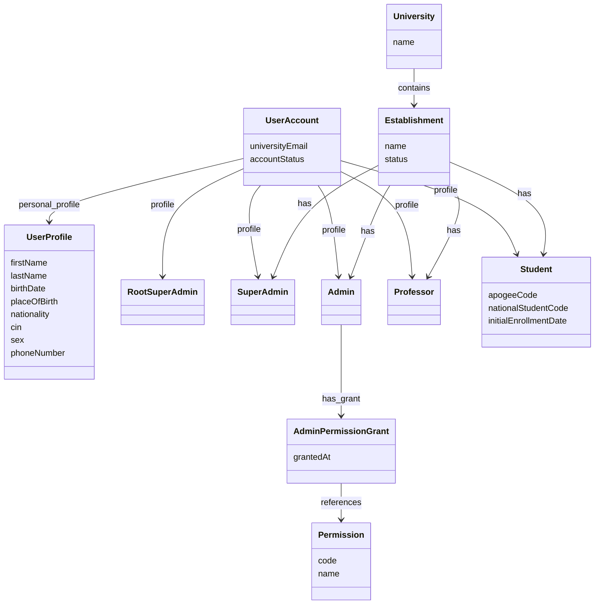
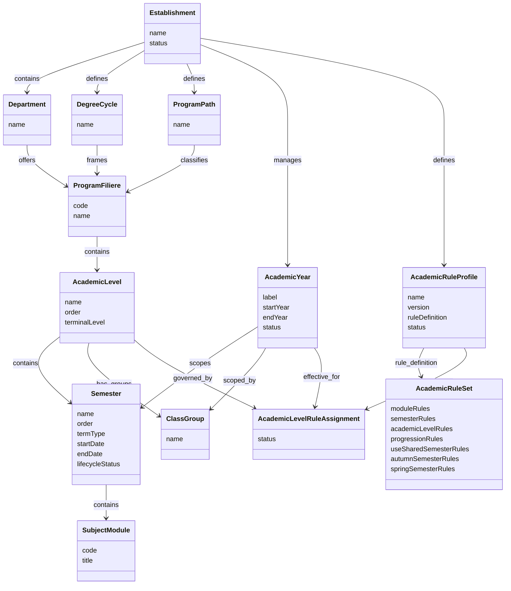
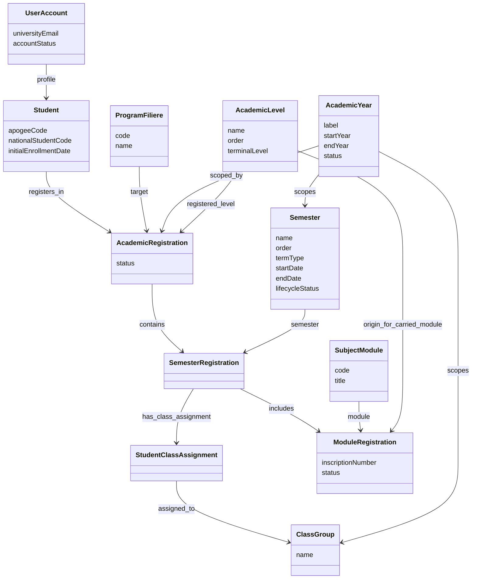
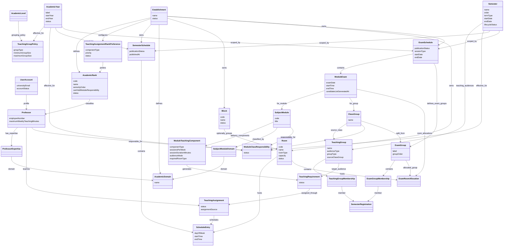
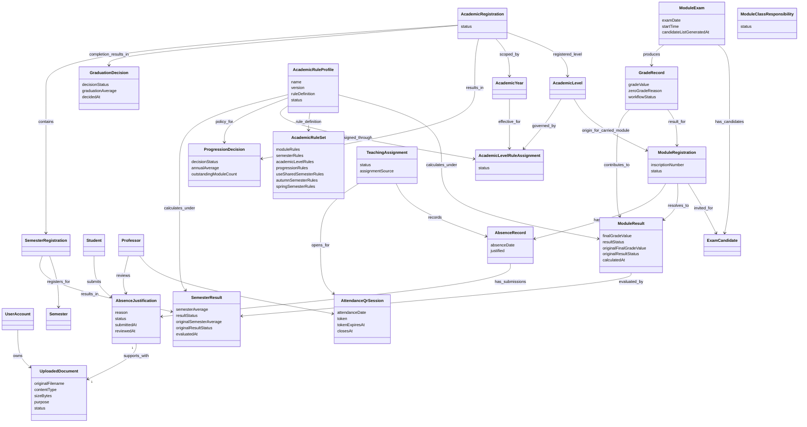

# Focused Domain Diagrams

These diagrams present the domain model as smaller business views. Each diagram covers one coherent area, shows the principal relationships, and limits attributes to those needed to understand the model.

## 1. Identity and Governance

Scope:

- Shows the separation between authentication identity, shared personal profile data, and business role profiles.
- Shows how university and establishment governance roles are organized.

## 2. Academic Structure

Scope:

- Shows the academic hierarchy inside an establishment.
- Clarifies department, degree cycle, program path, program/filiere, level, yearly semester, and subject/module structure.

## 3. Student Registration and Academic Path

Scope:

- Shows how a student is registered academically.
- Clarifies annual academic-level registration, automatic semester and module registration, later class assignment, and inscription history.

## 4. Teaching Delivery and Academic Planning

Scope:

- Shows how Course, TD, and TP requirements become professor assignments and scheduled room allocations.
- Separates Professor expertise, generated teaching audiences, and concrete teaching requirements.
- Shows separate Normal and Rattrapage schedules containing module-level exam occurrences.

Notes:

- `ClassGroup` remains the administrative grouping. Whole-cohort audiences combine classes, while class and subgroup teaching groups are derived from one source class and never mix its students with another class.
- `sessionsPerWeek` supports modules taught more than once each week.
- Course, TD, and TP components share the Subject/Module domains but may have different audience sizes, Professors, and room types.
- Rank preferences are establishment-specific and ordered independently for Course, TD, and TP assignments.
- Rank preference is applied after expertise and workload eligibility; it does not make an otherwise ineligible Professor assignable.
- Every room belongs directly to an establishment. A block is optional and only groups rooms in the same establishment, so standalone rooms and amphitheatres remain valid.
- An `ExamGroup` is a temporary split of one Class Group for the full Normal or Rattrapage `ExamSchedule`; it is not a teaching or administrative Class Group.
- `ExamGroupMembership` keeps the same student split across all module exams in that examination schedule.
- `ExamRoomAllocation` assigns each exam group to a room for one `ModuleExam`, allowing rooms to differ between module exams without changing group membership.
- When no split is needed, the Class Group is represented by one exam group and one room allocation for each module exam.
- Components are copied into a new academic year with their Subject/Module configuration, then changed independently when needed.
- Generation produces a draft. Publication remains an explicit management action.

## 5. Assessment, Progression, and Attendance

Scope:

- Shows how raw exam grades produce a calculated final module result for the semester.
- Shows progression decisions separately from raw grades.
- Shows professor-recorded attendance and exam eligibility in teaching context.

