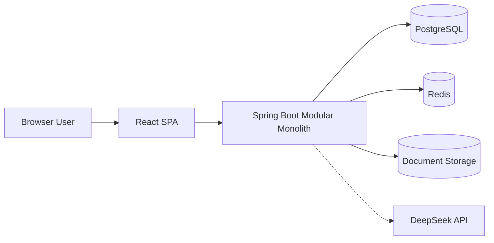
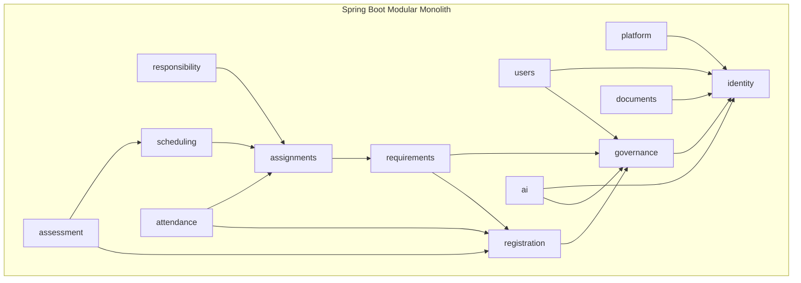
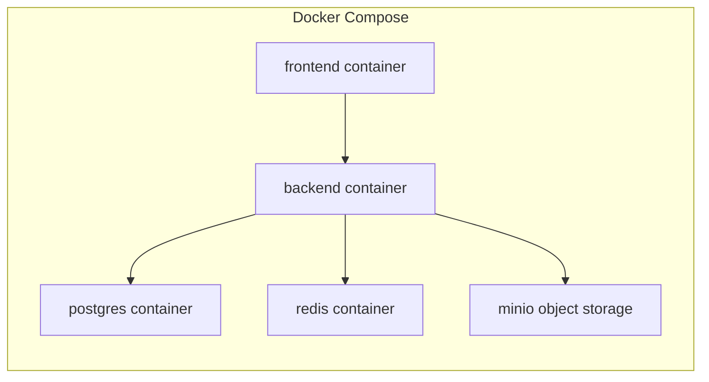

# System Architecture

This document defines the high-level system architecture of the university management platform.

## 1. Architecture Overview

The platform is implemented as a **modular monolith** with:

- `Spring Boot` for the backend application,
- `Spring Data JPA / Hibernate` for persistence,
- `PostgreSQL` as the primary database,
- `Redis` for short-lived infrastructure concerns,
- `React + TypeScript` for the web frontend,
- `JWT + Refresh Tokens` for authentication,
- `RBAC` for authorization,
- `Flyway` for database migrations,
- `Docker` and `Docker Compose` for local and server packaging,
- and `GitHub Actions` for continuous integration.

The system supports:

- one university root,
- many establishments,
- and clear separation between global governance, establishment management, teaching operations, and student self-service.

The monolith is modular, and infrastructure-heavy capabilities such as AI retrieval, document storage, and QR attendance sessions remain isolated behind application interfaces.

## 2. Architectural Principles

The architecture follows these principles:

- **Modular monolith first**: one deployable backend, one database, one frontend, clear internal module boundaries.
- **Domain-first structure**: modules are aligned to business capabilities, not to technical layers alone.
- **Separation of concerns**: domain logic, application orchestration, infrastructure, and presentation remain separated.
- **Establishment-aware access control**: establishment scope is enforced outside core domain logic.
- **Secure by default**: authentication, authorization, and historical integrity are first-class concerns.
- **Historical consistency**: published grades, schedules, absences, registrations, and calculated decisions remain visible historically.
- **Operational realism**: the design must be maintainable by one developer and deployable on modest infrastructure.
- **Explicit dependencies**: modules collaborate through application services and defined persistence or infrastructure contracts.

## 3. High-Level Architecture

At a high level, the system contains:

- one React SPA frontend,
- one Spring Boot modular monolith backend,
- one PostgreSQL database,
- one Redis instance,
- one S3-compatible document store,
- and one external language-model integration for the optional AI navigation feature.



The frontend production image serves the compiled SPA through Nginx. The browser calls the configured backend URL directly.

## 4. Backend Architecture

The backend is a single Spring Boot application organized as a modular monolith with four internal layers:

- `presentation`: REST controllers, request DTOs, response DTOs, security entry points
- `application`: use case orchestration, transactions, and authorization checks
- `domain`: entities, value concepts, domain services, business invariants
- `infrastructure`: JPA repositories, Redis, file storage, JWT, AI providers, establishment configuration

Architectural style:

- **package-by-module first**
- **layered inside each module**

This avoids a large global `controller/service/repository` structure and keeps each business capability cohesive.

### Backend request flow

- requests enter through the presentation layer
- security authenticates the user and enforces role, permission, and establishment scope
- application services execute use cases and coordinate persistence and infrastructure integrations

### API documentation

The backend exposes API documentation through `OpenAPI / Swagger`.

## 5. Module Organization

The modular monolith is organized around the implemented backend modules.

### 5.1 Core platform modules

- `platform`: bootstrapping, shared configuration, cross-cutting setup
- `identityaccess`: user accounts, login, refresh tokens, RBAC, password lifecycle
- `shared`: cross-module presentation and response types
- `ai`: read-only knowledge retrieval, constrained API planning, direct answers, and UI navigation

### 5.2 Governance and administration modules

- `universitygovernance`: establishments, academic structure, curricula, facilities, and rules
- `usermanagement`: super admin, admin, Professor, Student, permission, and user lifecycle management

### 5.3 Academic modules

- `academicregistration`: annual, semester, module, and class registration
- `teachingrequirement`: generated teaching demand for module components and audiences
- `teachingassignment`: manual and automatic Professor allocation and rank preferences
- `moduleclassresponsibility`: academic responsibility for a module and class context
- `scheduling`: teaching groups, weekly schedules, exam schedules, module exams, exam groups, and candidates
- `assessment`: grade workflow, module and semester results, progression, and graduation
- `attendance`: absence records, Redis-backed QR check-in, and justification review

### 5.4 Supporting services

- `documents`: private evidence metadata and object-storage access
- Student-facing operations remain inside the owning academic, scheduling, assessment, attendance, and document modules.

### Module interaction rule

Modules interact through explicit application services, domain contracts, and infrastructure adapters.

Modules do not bypass each other into internal repositories or internal domain objects without module-level intent.



Notes:

- The diagram shows dependency direction, not runtime call count.
- Arrows represent compile-time or application-service dependencies, not separate network calls.

## 6. Frontend Architecture

The frontend is a single React SPA written in TypeScript.

Frontend organization:

- feature-based folder structure,
- React Router for route segmentation,
- centralized authentication state,
- and role-based route guards.

### Frontend application areas

- management workspace for Root Super Admin, Super Admin, and Admin
- Professor workspace
- Student workspace
- shared UI, forms, API client, authentication, feedback, and layout packages

### Frontend responsibilities

- handle login and token lifecycle
- render role-specific navigation
- consume backend APIs through typed client services
- enforce UI-level permission visibility
- preserve clear feature boundaries matching backend modules

The frontend remains a single SPA. Establishment access is enforced on the backend through authentication, RBAC, and establishment ownership rules.

## 7. Database Architecture

`PostgreSQL` is the primary relational store.

The application uses one relational database for the platform.
This database stores:

- university-level data
- establishment-level administrative data
- academic structure and academic operations
- private document metadata

### Data organization

The database is organized around the same business boundaries defined in the modular monolith.

At a high level, it contains:

- global platform data such as university governance and global settings
- establishment-scoped data such as users, departments, programs, classes, schedules, exams, grades, absences, and private document metadata
- historical academic data that remains preserved across semesters and user lifecycle changes

Establishment ownership remains explicit in persisted data, either directly on the record itself or through its owning aggregate.

### Data integrity

Database integrity supports the application rules through:

- relational references between core records
- uniqueness and consistency constraints where required
- non-destructive lifecycle handling for archived and deactivated records

Academic and administrative history is preserved. Deactivation and archiving are status changes, not record deletion.

### Schema evolution

`Flyway` manages database versioning and schema evolution. Hibernate schema generation is disabled.

## 8. Authentication and Authorization

Authentication uses:

- short-lived access tokens as JWTs
- refresh tokens with rotation

Authorization uses:

- role checks for `RootSuperAdmin`, `SuperAdmin`, `Admin`, `Professor`, `Student`
- permission checks for permission-scoped admin operations
- establishment ownership and scope checks
- teaching-scope and personal-data scope checks

### Authentication flow

1. User authenticates with university email and password.
2. Backend verifies account status and credentials.
3. Backend issues access token and refresh token.
4. Refresh token is stored server-side with session metadata.
5. The frontend keeps the access token in memory and the refresh token for the current browser session.
6. Access token is used for API authorization.
7. Refresh flow rotates the refresh token and invalidates the previous one.

### Authorization model

- `RootSuperAdmin` is authorized at the university level
- `SuperAdmin` has all permissions inside one establishment
- `Admin` is authorized by explicit permission grants
- `Professor` is restricted to assigned teaching scope
- `Student` is restricted to personal academic services

## 9. Establishment Context

The platform supports multiple establishments inside one university platform.

Establishment context remains an application and authorization concern rather than a host-derived concern.

The architecture keeps:

- `Establishment` as the core business boundary
- establishment ownership on academic and operational data
- establishment-scoped authorization in the backend
- establishment identity available to authorized frontend views through the API

This keeps the domain model clean while ensuring that access and data visibility remain correctly scoped.

## 10. Redis Usage

Redis is used only for short-lived operational concerns.

Redis responsibilities:

- refresh token session storage and rotation tracking
- token revocation and logout invalidation
- active QR attendance sessions, rotating tokens, and checked-in Student identifiers

Academic and administrative records remain in PostgreSQL.

## 11. File and Document Storage

The `documents` module separates private file metadata from binary content.

### Storage model

- ownership, purpose, content type, size, and storage-key metadata stay in PostgreSQL
- binary content is stored through a storage abstraction

### Storage strategy

- local development uses a private MinIO bucket through Docker Compose
- the backend accesses MinIO through an S3-compatible storage abstraction
- the storage adapter targets the S3-compatible API rather than MinIO-specific domain behavior

This keeps the monolith simple while avoiding database bloat from storing large binary files directly in PostgreSQL.

### Minimal storage rules

- file type validation
- file size limits
- generated storage key independent of user filename
- user-account ownership and purpose-aware attachment validation
- private download through an authorized backend endpoint
- automatic cleanup of unattached temporary uploads
- controlled document status transitions for temporary, attached, and deleted files

## 12. AI Navigation Architecture

The AI assistant is a read-only application capability for Super Admin and Admin users.

- local API and UI knowledge is split into retrievable chunks and indexed with embeddings
- retrieval selects the API and route context relevant to the user's question
- the model produces either a direct answer plan or a navigation plan
- model-generated API reads are restricted to documented `GET` routes and execute with the caller's bearer token
- returned frontend routes are validated before the UI opens them
- conversation history is limited and remains in frontend memory
- model diagnostics are disabled by default and can be enabled through configuration

The AI module cannot bypass Spring Security or perform domain write operations.

## 13. QR Attendance Architecture

QR attendance is a temporary capture mechanism around the existing absence workflow.

- the assigned Professor opens a session for one teaching assignment and date
- Redis stores the session, rotating token expiry, close time, and checked-in Student IDs
- the Student must be authenticated and belong to the teaching scope
- the Professor reviews the resulting roster before confirming absences
- closing the session removes temporary Redis state
- only confirmed absence records are persisted in PostgreSQL

## 14. Security Architecture

Security design includes:

- password hashing with a strong adaptive algorithm
- JWT access tokens
- refresh token rotation
- role and permission enforcement
- establishment-bound access checks

### Access control layers

- **authentication**: who the user is
- **establishment scope**: which establishment context the user can operate in
- **authorization**: which role and permissions allow the requested action
- **data ownership checks**: whether the target data belongs to the same establishment or allowed scope


## 15. Validation and Exception Handling

Validation is applied at multiple layers.

### Validation layers

- presentation layer: request shape, required fields, formats
- application layer: cross-field and use-case validation
- domain layer: business invariants
- persistence layer: final database constraints

### Exception handling strategy

Centralized exception handling covers:

- authentication failures
- authorization failures
- validation failures
- business rule violations
- resource not found
- unexpected internal errors

Response behavior uses a consistent JSON structure containing the HTTP status in `error` and a human-readable `message`.

## 16. Testing Strategy

The testing strategy is layered and selective.

### Backend testing

- domain unit tests for academic and authorization rules
- application service tests for use case orchestration
- repository and service tests under the isolated test profile
- security tests for role, permission, and establishment-scope checks
- controller or API slice tests for request validation and error mapping

### Frontend testing

- unit tests for utility and state logic
- component tests for key feature screens
- route and guard tests for role-based navigation

### End-to-end testing

Playwright is configured for browser-level flows. The current CI pipeline runs backend tests and frontend typecheck, unit tests, and production build.

## 17. Docker Architecture

Docker Compose provides a reproducible local environment and container packaging.

### Local Docker Compose services

- `frontend`
- `backend`
- `postgres`
- `redis`
- `minio`

### Local environment goals

- one-command startup
- reproducible developer environment
- isolated dependency versions
- straightforward debugging



## 18. Continuous Integration

GitHub Actions validates pull requests and pushes to `main` and `develop`.

### CI stages

- backend Maven tests on Java 17
- frontend TypeScript typecheck
- frontend unit tests
- frontend production build

Continuous deployment remains separate from the repository's validation pipeline.

## 19. Deployment Boundary

The deployable system consists of the frontend image, backend image, PostgreSQL, Redis, and S3-compatible object storage. DNS, TLS termination, infrastructure provisioning, backups, and monitoring are supplied by the target hosting environment and are not defined in this repository.

## 20. Project Structure

Repository structure:

```text
ysnUniversity/
├── backend/
│   ├── src/main/java/com/platform/
│   │   ├── platform/
│   │   ├── shared/
│   │   ├── identityaccess/
│   │   ├── usermanagement/
│   │   │   ├── superadmin/
│   │   │   ├── admin/
│   │   │   ├── professor/
│   │   │   ├── student/
│   │   │   └── permission/
│   │   ├── universitygovernance/
│   │   │   ├── university/
│   │   │   ├── establishment/
│   │   │   ├── department/
│   │   │   ├── degreecycle/
│   │   │   ├── programpath/
│   │   │   ├── programfiliere/
│   │   │   ├── academicyear/
│   │   │   ├── academiclevel/
│   │   │   ├── semester/
│   │   │   ├── subjectmodules/
│   │   │   ├── classgroup/
│   │   │   ├── academicdomain/
│   │   │   ├── academicruleprofile/
│   │   │   ├── academiclevelruleassignment/
│   │   │   ├── moduleteachingcomponent/
│   │   │   ├── block/
│   │   │   └── room/
│   │   ├── academicregistration/
│   │   │   ├── registration/
│   │   │   ├── semesterregistration/
│   │   │   ├── moduleregistration/
│   │   │   └── classassignment/
│   │   ├── teachingrequirement/
│   │   ├── teachingassignment/
│   │   │   └── rankpreference/
│   │   ├── moduleclassresponsibility/
│   │   ├── scheduling/
│   │   │   ├── teachinggroup/
│   │   │   ├── semesterschedule/
│   │   │   ├── examschedule/
│   │   │   ├── moduleexam/
│   │   │   ├── examgroup/
│   │   │   └── examcandidate/
│   │   ├── assessment/
│   │   │   ├── graderecord/
│   │   │   ├── moduleresult/
│   │   │   ├── semesterresult/
│   │   │   ├── progressiondecision/
│   │   │   └── graduationdecision/
│   │   ├── attendance/
│   │   │   ├── absencerecord/
│   │   │   └── qrcheckin/
│   │   ├── documents/
│   │   └── ai/
│   │       ├── retrieval/
│   │       └── navigation/
│   ├── src/main/resources/
│   │   ├── db/migration/
│   │   ├── application.yml
│   │   ├── application-dev.yml
│   │   └── application-prod.yml
│   └── Dockerfile
├── frontend/
│   ├── src/
│   │   ├── app/
│   │   ├── features/
│   │   ├── shared/
│   │   └── workspaces/
│   └── Dockerfile
├── infra/
│   └── compose/
├── .github/
│   └── workflows/
└── docs/
```

### Internal backend package convention per module

Each module follows:

```text
module-name/
├── domain/
├── application/
├── infrastructure/
└── presentation/
```

This keeps module boundaries explicit and avoids technical-layer sprawl.
